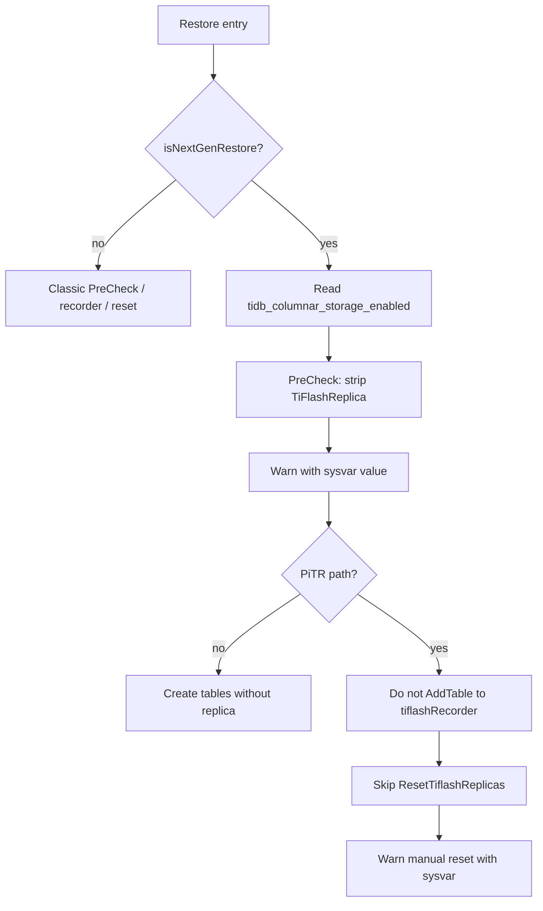

# Next-Gen BR / PiTR: Skip TiFlash Replica Restore

- Author(s): [JaySon-Huang](https://github.com/JaySon-Huang)
- Discussion PR: TBD
- Tracking Issue: TBD

## Table of Contents

* [Introduction](#introduction)
* [Motivation or Background](#motivation-or-background)
* [Behavior Contract](#behavior-contract)
* [Detailed Design](#detailed-design)
    * [Policy](#policy)
    * [Snapshot BR: PreCheckTableTiFlashReplica](#snapshot-br-prechecktabletiflashreplica)
    * [PiTR: recorder and ResetTiflashReplicas](#pitr-recorder-and-resettiflashreplicas)
    * [Reading tidb_columnar_storage_enabled](#reading-tidb_columnar_storage_enabled)
    * [Other restore entry points](#other-restore-entry-points)
    * [Compatibility](#compatibility)
* [Test Design](#test-design)
    * [Functional Tests](#functional-tests)
    * [Scenario Tests](#scenario-tests)
    * [Compatibility Tests](#compatibility-tests)
* [Impacts & Risks](#impacts--risks)
* [Investigation & Alternatives](#investigation--alternatives)
* [Unresolved Questions](#unresolved-questions)
* [Non-Goals / Follow-ups](#non-goals--follow-ups)

## Introduction

This design unifies **Next-Gen** Snapshot BR and PiTR behavior for TiFlash replicas:
**never restore TiFlash replica metadata automatically**, regardless of whether
`tidb_columnar_storage_enabled` is `ON` or `OFF`.

Snapshot BR already strips TiFlash replicas in `PreCheckTableTiFlashReplica` when
`isNextGenRestore` is true. That strip path stays unchanged; only the warn log is
extended to print the current `tidb_columnar_storage_enabled` value for diagnosis.
PiTR must be aligned so it no longer re-applies replicas via `tiflashRecorder` +
`ALTER TABLE ... SET TIFLASH REPLICA` after log restore.

Operators who need columnar replicas after a Next-Gen restore must turn Columnar
Storage on (if required by the DDL gate) and run `SET TIFLASH REPLICA` manually.

## Motivation or Background

TiDB already has a cluster-level DDL gate `tidb_columnar_storage_enabled` for
explicit opt-in when `cse.columnar-store-type` is `columnar` or `both`. Adding
TiFlash replicas (`SET TIFLASH REPLICA n` with `n > 0`, `CREATE TABLE` /
`CREATE TABLE LIKE` that would persist replica metadata) is rejected when the
flag is not an explicit opt-in (`ON` / `1`).

On the BR side, Next-Gen Snapshot restore already disables TiFlash replicas in
precheck:

```go
// br/pkg/task/restore.go — PreCheckTableTiFlashReplica
if isNextGenRestore {
    log.Warn("Restoring to NextGen TiFlash is experimental. " +
        "TiFlash replicas are disabled; please reset them manually after restore.")
    // strip table.Info.TiFlashReplica for all tables
    return nil
}
```

PiTR is inconsistent with that policy today:

1. Snapshot phase of PiTR goes through the same PreCheck and strips replicas
   (and, on Next-Gen, returns before recording into `tiflashRecorder`).
2. Log restore still uses `AfterTableRewrittenFn` to **record** TiFlash replica
   configs seen in meta KV / DDL history and clears them from rewritten table
   info for the duration of restore.
3. At the end of PiTR, `ResetTiflashReplicas` generates and executes
   `ALTER TABLE ... SET TIFLASH REPLICA n`.

Consequences:

| `tidb_columnar_storage_enabled` | PiTR reset today | Problem |
| --- | --- | --- |
| `ON` | ALTER often **succeeds** | Breaks “Next-Gen never auto-restore TiFlash”; diverges from Snapshot BR |
| `OFF` | ALTER hits DDL gate; errors are retried then **swallowed** with a warn | Restore may succeed without replicas, but without a clear, unified policy message |

The goal of this design is to make Next-Gen Snapshot BR and PiTR share one
operator-visible contract: **strip / do not restore, warn, ask for manual reset**,
and include the columnar-storage flag in the warn for troubleshooting.

Classic (non–Next-Gen) BR / PiTR behavior is out of scope.

## Behavior Contract

| Scenario | Behavior |
| --- | --- |
| Next-Gen Snapshot BR | `PreCheckTableTiFlashReplica` clears all `TiFlashReplica` on table infos; warn (including `tidb_columnar_storage_enabled`); create tables **without** TiFlash metadata |
| Next-Gen PiTR (snapshot + log) | Do **not** restore TiFlash replicas; do **not** call `ResetTiflashReplicas`; log-rewrite path clears `TiFlashReplica` and must **not** `AddTable` into `tiflashRecorder` (or equivalent: ensure recorder is empty before reset); warn (including sysvar) that operators must reset manually after restore |
| Classic Snapshot BR / PiTR | Unchanged by this design |

Important:

- On Next-Gen, **`tidb_columnar_storage_enabled` does not decide whether to strip**.
  Strip / skip-reset is unconditional for Next-Gen.
- The sysvar value is **diagnostic only** (printed in warn logs).
- After restore, tables have no TiFlash replica; enabling Columnar Storage and
  running `ALTER TABLE ... SET TIFLASH REPLICA` remains the supported way to
  bring replicas back.

## Detailed Design

### Policy

```text
IF restore targets Next-Gen (isNextGenRestore == true):
    NEVER persist or re-apply TiFlash replica configs during BR / PiTR
    ALWAYS warn that replicas were skipped and must be set manually
    ALWAYS include tidb_columnar_storage_enabled in that warn when readable
ELSE:
    keep existing classic BR / PiTR TiFlash handling
```



### Snapshot BR: PreCheckTableTiFlashReplica

**File:** [`br/pkg/task/restore.go`](../../br/pkg/task/restore.go)

Keep the existing control flow:

```go
if isNextGenRestore {
    // strip all table.Info.TiFlashReplica
    // warn + return
}
```

Do **not** introduce a branch on `tidb_columnar_storage_enabled` for strip vs keep.

Change only the warn content / fields, for example:

- Message: Next-Gen restore does not restore TiFlash replicas; reset manually after restore.
- Structured field: `tidb_columnar_storage_enabled=<raw or normalized value>`
- If the variable cannot be read: log `unavailable` / `unknown` (fail-closed for
  diagnostics only) and still strip; **do not fail the restore**.

Call site already passes `isNextGenRestore` from
`utils.CheckNextGenCompatibility(...)`. The precheck may need an extra argument
(session / domain / pre-read string) only to obtain the sysvar for logging.

### PiTR: recorder and ResetTiflashReplicas

**File:** [`br/pkg/task/stream.go`](../../br/pkg/task/stream.go)

Today:

1. `cfg.tiflashRecorder = tiflashrec.New()` is always created for PiTR.
2. Checkpoint may `Load(TiFlashItems)` into the recorder.
3. `buildSchemaReplace` → `AfterTableRewrittenFn` does:

   ```go
   cfg.tiflashRecorder.AddTable(tableInfo.ID, *tableInfo.TiFlashReplica)
   tableInfo.TiFlashReplica = nil
   ```

4. After log restore:

   ```go
   sqls := cfg.tiflashRecorder.GenerateAlterTableDDLs(...)
   client.ResetTiflashReplicas(ctx, sqls, g)
   ```

Required Next-Gen behavior:

1. **`AfterTableRewrittenFn`**: when Next-Gen, clear `tableInfo.TiFlashReplica`
   but **do not** `AddTable` (and `DelTable` on delete / nil remains fine).
2. **Checkpoint**: if Next-Gen, do not load `TiFlashItems` for the purpose of
   later reset; or load but never generate reset SQLs. Prefer not feeding the
   recorder so skip-reset is obvious.
3. **End of PiTR**: when Next-Gen, **skip** `ResetTiflashReplicas` entirely;
   emit a warn (with `tidb_columnar_storage_enabled`) that any TiFlash replicas
   from the backup must be set manually.
4. Optional hygiene: clear recorder items when skipping so checkpoint metadata
   does not reintroduce reset work on resume.

Whether Next-Gen is detected the same way as Snapshot
(`CheckNextGenCompatibility` / `isNextGenRestore`) should be shared or stored on
restore config so Snapshot and PiTR cannot disagree.

### Reading tidb_columnar_storage_enabled

- Prefer BR glue session APIs already used elsewhere
  (`GetGlobalVariable` / Domain sysvar cache).
- Raw string is enough for the warn field.
- Optional normalization with `variable.TiDBOptOn` / `BoolToOnOff` is allowed
  **only for log readability**; it must **not** change strip / skip-reset
  decisions on Next-Gen.
- Read failure: log unknown/unavailable; continue strip / skip-reset.

### Other restore entry points

**File:** [`br/pkg/task/restore_data.go`](../../br/pkg/task/restore_data.go)

`resetTiFlashReplicas` scans tables that already have TiFlash metadata and
re-issues `ALTER TABLE ... SET TIFLASH REPLICA`. If a Next-Gen restore flow can
reach this helper, apply the same policy: **skip + warn with sysvar**, do not
wait for DDL gate failures.

Incremental Snapshot DDL blocklist already filters
`ActionSetTiFlashReplica` / `ActionUpdateTiFlashReplicaStatus` in
`incrementalRestoreActionBlockList`; no change required for that list under this
design.

DDL gate itself (`checkColumnarStorageEnabled*` in `pkg/ddl`) remains the
safety net for user / leaked SQL paths and is **not** replaced by BR logic.

### Compatibility

- **DDL / Columnar Storage gate**: unchanged; Next-Gen BR simply avoids
  depending on post-restore ALTER success.
- **TiFlash**: Next-Gen restore leaves tables without replicas; query plans will
  not use TiFlash until operators re-set replicas.
- **Upgrade**: Old backups restored to Next-Gen continue to land without
  replicas (Snapshot already did this; PiTR becomes consistent with it).
- **Downgrade / Classic**: Classic restore paths unchanged.
- **Checkpoint / resume**: Next-Gen resume must not revive TiFlash reset from
  persisted `TiFlashItems`.

## Test Design

### Functional Tests

- Next-Gen `PreCheckTableTiFlashReplica`: all tables lose `TiFlashReplica`;
  restore does not fail when sysvar read fails; warn path can observe the
  sysvar field (unit test / mock).
- Next-Gen PiTR: `tiflashRecorder` has no items requiring reset **or**
  `ResetTiflashReplicas` is not invoked; cover both
  `tidb_columnar_storage_enabled=ON` and `OFF` to prove the flag does not
  re-enable auto-restore.
- Log rewrite callback on Next-Gen: `TiFlashReplica` cleared without
  `AddTable`.

These checks do **not** require a live TiFlash cluster; asserting “no ALTER
generated / no reset called” is sufficient.

### Scenario Tests

- Full Snapshot restore of a backup that contains TiFlash-enabled tables onto
  Next-Gen: tables exist, `INFORMATION_SCHEMA.TIFLASH_REPLICA` empty / no
  replica metadata; warn present.
- PiTR with TiFlash changes in the log range onto Next-Gen: final schemas have
  no auto-restored replicas; warn present; restore status success is independent
  of the columnar flag.

### Compatibility Tests

- Classic restore with TiFlash still records / resets as today (regression).
- Next-Gen + ON no longer silently restores via PiTR (intentional behavior
  change; assert in test).
- Checkpoint resume on Next-Gen does not execute deferred TiFlash reset SQLs.

Benchmark tests are not required for this behavior change.

## Impacts & Risks

### Impacts

- **Positive / intentional**: Snapshot BR and PiTR share one Next-Gen TiFlash
  policy; operators get a consistent warn that includes
  `tidb_columnar_storage_enabled`.
- **Intentional behavior change**: Next-Gen PiTR with
  `tidb_columnar_storage_enabled=ON` **stops** automatically restoring TiFlash
  replicas. Clusters that relied on PiTR ALTER success must re-set replicas
  manually (same as Snapshot BR today).

### Risks

- Operators may miss the warn and assume TiFlash replicas were restored;
  mitigate with clear log wording and, if needed, restore summary text.
- If any Next-Gen path still calls reset helpers without the new skip, DDL may
  still apply replicas when the flag is ON; tests must cover all entry points
  listed above.
- Sysvar cache lag is possible; because the value is diagnostic only, lag does
  not change restore correctness under this design.

## Investigation & Alternatives

1. **Branch Next-Gen strip on `tidb_columnar_storage_enabled=OFF` only**  
   Rejected for Snapshot PreCheck: existing Next-Gen behavior already always
   strips; product decision is to keep “Next-Gen never auto-restore TiFlash”
   even when the flag is ON. The flag remains diagnostic in warn logs.

2. **Keep PiTR reset when ON, skip only when OFF**  
   Rejected: ON would still diverge from Snapshot BR and reintroduce automatic
   replica creation on Next-Gen.

3. **Fail the whole restore when TiFlash replicas cannot be restored**  
   Rejected for this iteration: Snapshot BR already succeeds after strip; PiTR
   should match that availability-first behavior and push replica recreation to
   operators.

4. **Use `SetTiFlashReplicaArgs.Internal` to bypass the DDL gate for BR**  
   Rejected as the primary Next-Gen policy: the product intent is not to restore
   replicas automatically on Next-Gen, not to punch a hole through the gate.

## Unresolved Questions

- Exact Tracking Issue / Discussion PR numbers (fill when opened).
- Whether restore CLI / summary output (in addition to logs) should print a
  short “TiFlash replicas skipped” line for Next-Gen.
- Whether `restore_data.go` Next-Gen reachability needs a dedicated integration
  fixture or only a unit-level skip guard.

## Non-Goals / Follow-ups

- Classic BR / PiTR TiFlash handling (including store-count precheck and
  recorder-based reset).
- Classic + `tidb_columnar_storage_enabled=OFF` causing
  `CreateTableWithInfo` / batch create to fail when backup tables still carry
  TiFlash metadata (known follow-up; not solved by always-strip on Next-Gen
  alone).
- Full “safely tear down Columnar infrastructure” protocol (sysvar cache
  propagation barriers, old-node barriers, BR semantics beyond Next-Gen skip).
- Changing DDL gate fail-closed rules or HTTP `GET /tiflash/replica` semantics.
